  

### Independent security research lab

**vulnerability research** · **systems security** · **fuzzing** · **AI security**

## Focus areas

- **Vulnerability research** — exploitability analysis across userland & kernel
- **Systems security** — memory safety, sandboxing, privilege separation
- **Coverage-guided fuzzing** — harness engineering, corpus & dictionary strategy
- **AI security** — LLM red-teaming, agent abuse cases, ML supply chain

## Repositories

| Repo | Description |
| --- | --- |
| [`fuzzing-harnesses`](../fuzzing-harnesses) | libFuzzer/AFL++ harness templates, dictionaries, seed corpora |
| [`vuln-research`](../vuln-research) | Research note & advisory templates, PoC skeletons |
| [`ai-security-eval`](../ai-security-eval) | LLM/agent security evaluation harness starter |

## Disclosure

Coordinated disclosure 90-day default window, extensions negotiated in good faith. We do not publish details before vendor coordination.

**Security reports:** [ihopenre@gmail.com](mailto:ihopenre@gmail.com) include reproduction steps and affected versions.
